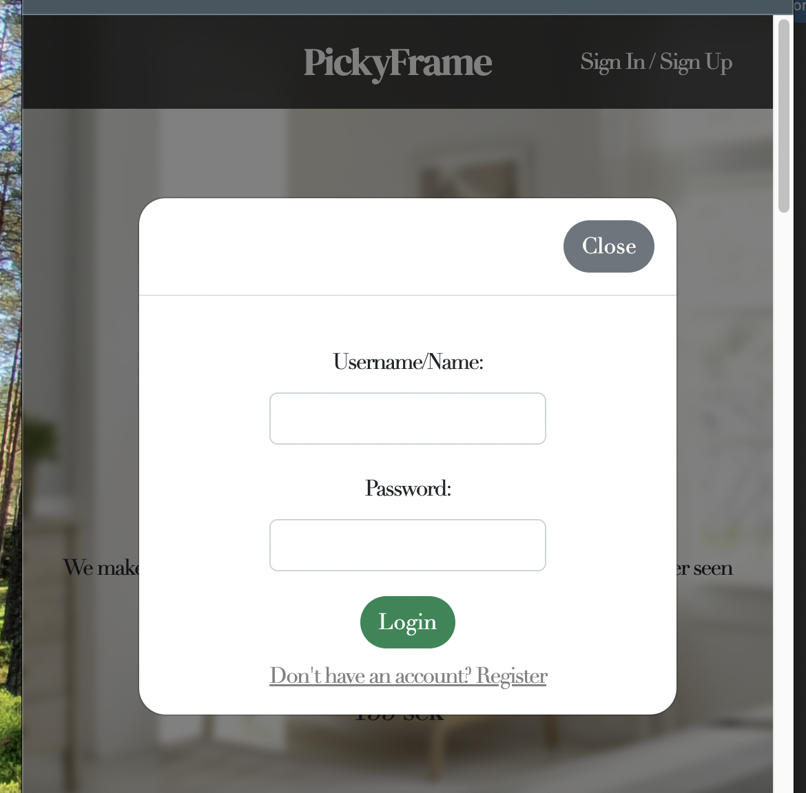
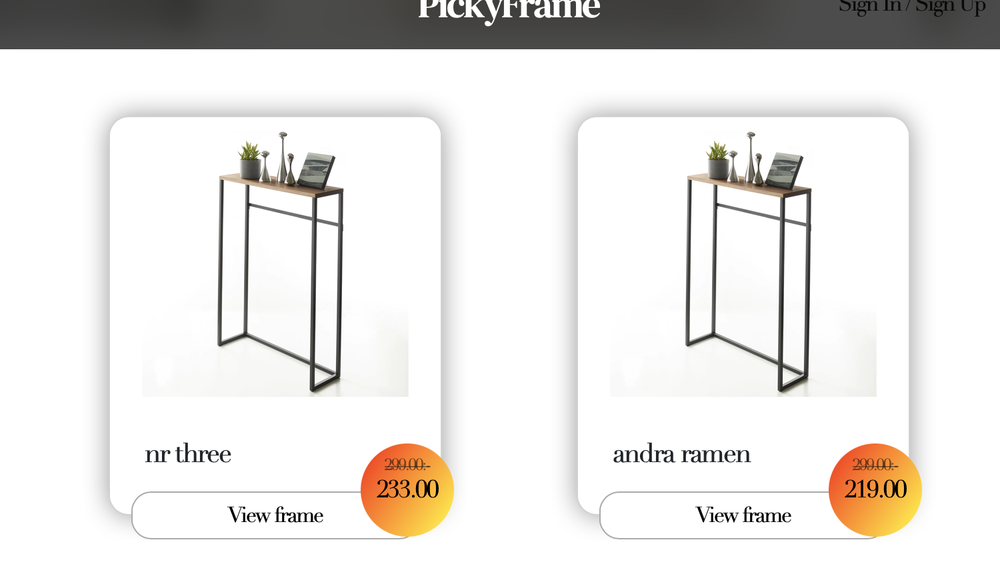

# pickyproducts
Django project CMS for CRUD operations regarding PickyFrame

> 1. [What is it](#what-is-pickyproducts)
> 2. [UI & UX](#ui-&-ux)
> 3. [Features and pages](#features-and-pages)
> 4. [X] [Installing Django](#install-django)
> 5. [X] [Showing items from db](#showing-items-from-dbproducts)
> 6. [X] [Adding Item to db](#adding-items-to-db)
> 7. [X] [Updating Item in db](#updating-items-in-db)
> 8. [X] [Deleting Item from db](#deleting-item-from-db)
> 9. [Testing](#testing)
> 10. [Deployment](#deployment)
> 11. [Tech](#technologies) 
> 12. [Support](#support)

## What is PickyProducts?

PickyProducts is a Fullstack project from me, Thomas Forselius; a '22 season student at CodeInstitute front end developer course. 
The project is fullstack, that has admin/crud capabilities for managing products in a database. 

The idea and goal with this project is to implement it into my upcoming website that is in the works and will be launched later in the year. 
It will have a webshop that will utilize the same products and database as this project. It's so much more enticing to acutally code a project that will be used in a real world scenario. This keeps the life of the project fresh!

## UI & UX

- On of the most important features of webpages today is being responsive, since the largest amount of people view webpages on their mobile devices. Responsive websites are a must, if your goal is the keep the interest of the visitor
- My idea when creating this page is that I wanted to simple and esthetically pleasing design without too much flashy functions and design elements that draw attention away from the product itself. 
- Colors used are simple - I wanted to keep it simple with a high contrast for maximum accessibility; 
    - Black text on white background, great contrast and very relatable color combination
    - Soft beige color palette, the go-to-choice for vloggers, bloggers and interior design photographers. "Know your target audience"
    - The green details and accent colors are a good and simple way to create a subtle colorful feel on the page without spoiling the laid back feeling from the beige

### Typography

- The fonts I have chosen are serif, to give a sense of 'classic' and 'elegant'
    - Font 1: Didot
        - This is the main font for the whole page
        - Link: https://www.cufonfonts.com/download/font/single/97226/didot-2
    - Font 2: DM Serif Display
        - This is the font for the logo
        - https://fonts.google.com/download?family=DM%20Serif%20Display

### Background-image

- The background I chose for the landing page is a casual but styled living room. The image is blurred to keep the users intrest focused on the logo or product. Otherwise the background can become to distracting and draw attention away from the real point of intrest
- It just as well on large devices as well as mobile devs.
- THe design is done from 'Mobile first' mindset, but adapted to work on larger screens as well thanks to resposive design media queries
- The page i use for free images is Freepik, https://www.freepik.com/

### Navigation

The navigation is a simple nav-bar at the top of the page with only 2 clickable links: 

- Logo: clicking here returns the user to the default page
- At the top right: 
    - If you are not yet signed in, you can sign up or sign in. 
        - Clicking this shows a popup where you can enter login credentials or click to go to the register page
        
    - If you are signed in, you will have a 'profile' icon and your name next to it.
        
        - Clicking this shows a popup with your username at the top
            - If you are logged in as admin, you get three links: 
                - Add products - redirects you to a page where you can add new products
                - Show products list - redirects you to a page that handles crud operations of the products on the page
                - Logout
                
            - If you are logged in as a regular user, you only get one link at the moment: 
                - (coming feature) Profile page
                - Logout
- The only (at the moment) clickable component on the page is each product, where when you click 'View product' a modal popup will appear showing the selected products information


## Features and pages

- Landing page: the default page you will view products at
    - (at the moment there is only view functionality for the products, unless you are admin/staff)
    - When scrolling through products you can click 'view frame' to open a popup with more informaiton regarding the chosen product
- Register page: if you don't have an account, this is were you register as a user
- Login page: this is where you login when you have registered

- The basic feature of the webpage is a user friendly product management system where you can register as a user. 
- Admins/Staff are added either through the django-admin terminal commands or via the integrated web-ui @ 'webpage'/admin
    - As an admin, you want to be able to create, read, update and delete products, by registering at the first page
    - As a regular user, you want to be able to read products, by registering at the first page

- There are 4 main sections to the landing page: 
    - Hero section
        - This is the first thing the visitor sees when entering the webpage. Here there is a cta(call-to-action) button where you get a modal popup with a nice product view to quickly get a good idea of what the page is about.
        - There is a short text description as well, with a catchy slogan
    - Products
        - This section displays all the products that we have to offer on the webpage, each on a separate 'card'
    
    - Features
    - Qoutes from users


## Install Django: 

These are the installing and deployment steps for starting and running a Django project:

- to get the latest verion before 4, since 4 is not long term supported
-   ```
    pip3 install 'django<4'
    ```
- starts a new django project with the name 'pickyproducts'
-   ```
    django-admin startproject pickyproducts .
    ``` 
- starts a new django app with the name 'productsadmin'
-   ```
    python3 manage.py startapp productsadmin
    ```
- starts the django server
-   ```
    python3 manage.py runserver
    ```
- creates basic databases
-   ```
    python3 manage.py migrate
    ```
- creates superuser in db
-   ```
    python3 manage.py createsuperuser
    ```
- Create/update db model in *models.py* / this is where you design your model structure
    sets up new model for db, ready for migration
-   ```
    python3 manage.py makemigrations
    ```    
- creates new migration in db / creates tables and relations
-   ```
    python3 manage.py migrate
    ```

- Open admin.py and add: 
    -   ```python
        from models import Product
        ````
        Note: Product is the name of the table created in *models.py*
    - further down, add the following: 
        -   ```python
            admin.site.register(Product)
            ```

### Showing items from db: 

- In *views.py* , add a new class using the following lines:
    -   ```python
        def show_prod(request):
            products = Product.objects.all()
            context = {
                'products' : products
            }
            return render(request, 'admin/show_prod.html', context)
        ```
        *the variable 'products' is what you use to show products in show_prod.html, by using a for-loop to iterate through*.
        
        *i.e. *

- In *urls.py*, add the following information: 
    -   ```python
        from productsadmin.views import show_prod 
        ```  
        *show_prod* is the name of the class defined in *views.py*
    - in urlpatterns, add the following:
        -   ```python
                path('', show_prod, name='show_prod')
            ```

- Now go to your local server and add '/admin' in the address field to access admin panel
- Login using the superuser credentials you created earlier
- Under the Users table, Products should appear
- To make added items display names instead of 'Item #number' in products table the following line has to be added to *models.py*:
    -   ```python
            def __str__(self):
            return self.name
        ```

- In the file show_prod.html, use this code to iterate through the dictionary of items imported from the view.py file:
    -   ```python
         
        ```
    - Now in this for-loop you can use *product.name, product.id, product.price and so on to display eache key value*

### Adding items to db:

To add items to the database you need to add a frontend page by following these steps:

- In *views.py* add the following:
    -   ```python
        def add_prod(request):
            if request.method == "POST": 
                name = request.POST.get("name")
                price = request.POST.get("price")
                desc = request.POST.get("desc")
                sale = 'sale' in request.POST
                sale_price = request.POST.get("sale_price")
                Product.objects.create(name=name, price=price, desc=desc, sale=sale, sale_price=sale_price)
                return redirect('show_prod')
        return render(request, 'admin/add_prod.html')
        ```
        This will define a function called add_prod
- In *urls.py*, add the following information behind *from productsadmin.views import show_prod*: 
    - add_prod / 'add_prod' is the name of the class defined in 'views.py'
    - in *urlpatterns*, add the following:
        -   ```python
                path('add', add_prod, name='add_prod')
            ```
- In the */templates/admin/* folder, create a new page called "add_prod.html"
- In the *add_prod.html* page, add your boilerplate html code and form with corresponding input fields to match your product model
- Now when you click sumbit, the field values will transfer to the *views.py* file and be inserted into the db
- You will then be redirected back to *show_prod.html* where the newly added product should appear

### Updating items in db

- In *views.py*, add the following information behind *render, redirect*: 
    -   ```python
            get_object_or_404
        ```
        *this function imports the product form the db using the prod_id as a primary key*
- In *views.py*, create a new function called edit_prod with the following code:
    ```python
    def edit_prod(request, prod_id): 
        prod = get_object_or_404(Product, id=prod_id)
        if request.method == "POST":
            name = request.POST.get("name")
            price = request.POST.get("price")
            desc = request.POST.get("desc")
            sale = 'sale' in request.POST
            sale_price = request.POST.get("sale_price")
            Product.objects.filter(pk=prod_id).update(name=name, price=price, desc=desc, sale=sale, sale_price=sale_price)
            return redirect('show_prod')
        context = {
            'name' : prod.name,
            'price' : prod.price,
            'desc' : prod.desc,
            'sale' : prod.sale,
            'sale_price' : prod.sale_price
        }
        return render(request, 'admin/edit_prod.html', context)
    ```
- In *urls.py*, add the following information behind *from productsadmin.views import show_prod, add_prod*: 
    -   ```python
        edit_prod
        ```
        *edit_prod* is the name of the class defined in 'views.py'
    - In the *urlpatterns* section, add the following: 
        -   ```python
            path('edit/<prod_id>', edit_prod, name='edit_prod') 
            ```
- To make sure that only the selected item in the db is updated, the following code must be added: 
    -   ```python 
        Product.objects.filter(pk=prod_id).update(name=name, price=price, desc=desc, sale=sale, sale_price=sale_price)
        ```
    - the *.filter(pk=prod_id)* part filters out a selected item to be updated via the *.update()* function that follows
- Create a new file called *edit_prod.html*. This wil be a clone of *add_prod.html*, but will populate the fields based on the data that is got from the db.
- To populate the corresponding input field, use the following codes:
    -   ```python
        {{ name }}
        ```
         *imports the value of name*
    -   ```python
        {{ price }}
        ```
        *imports the value of price*
    -   ```python
        {{ desc }}
        ````
        *imports the value of desc*
    -   ```python
        {{ sale_price }}
        ```
        *imports the value of sale_price*
    -   ```python
        {{ sale }}
        ````
        *imports the value of sale*
        
    - Since *sale* is a boolean function, the following if-loop will display a checked checkbox if sale equals True
        -   ```python
            
            <input type="checkbox" id="sale" name="sale" checked>
            
            <input type="checkbox" id="sale" name="sale" >
            
            ```

- Now when you click sumbit, the field values will transfer to the views.py file and be inserted into the db. 
- You will then be redirected back to *show_prod.html* where the newly added product should appear

### Deleting item from db

- In *views.py*, add the following to create a new function called *remove_prod*: 
    ```python
        def remove_prod(request, prod_id):
        prod = get_object_or_404(Product, id=prod_id)
        Product.objects.filter(pk=prod_id).delete()
        return redirect('show_prod')
    ```
- In your show_prod.html, add the following to create a button for the delete function: 
    ```html
        <a href="/remove/{{ product.id }}"><button>Remove</button></a>
    ```
- In *urls.py*, add the following path: 
    ```python
        path('remove/<prod_id>', remove_prod, name='remove_prod')
    ```
- In *urls.py*, add the following path to import view: 
    - After 
    ```python
        from productsadmin.views import ...
    ```
    Add this to import that view: 
    ```python
        remove_prod
    ```

## Testing

## Deployment

- Heroku is a free (until Nov 28'th) webpage where you can host your back end web projects, and connect them to GitHub to make use of front end functionality.

The process of setting up my project on Heroku is the following:

- To be able to connect to our Postrgres database on Heroku, we need to install a library called: Psycopg2. This will allow the database to be stored in a permanent way, instead of a file in the project that may be deleted every time the heroku app shuts down.
    - To install this package, type the following in your VSCode(or equivalent) terminal:
    ```
    pip3 install psycopg2-binary
    ```
    -  Another library we need is called Gunicorn, which replaces the local server with the Heroku server wonce deployed. To install this, enter the following in your VSCode(or equivalent) terminal: 
    ```
    pip3 install gunicorn
    ```
    - The next package to install is called *dj_database_url*. This makes it possible to get the url for the database that Heroku created, so we can connect to it. Install by running the following command: 
    ```
    pip3 install dj_database_url
    ```
- Sign up / Log in to your Heroku account
- Top right corner -> Create new app
- Choose app name and region and click create app
- Resources -> Add-ons: type 'postgres'. Then click Heroku Postgres
- Settings -> Config Vars -> Reveal Config Vars -> Copy the DATABASE_URL value ('postgres://....')
- Open your project folder, and in there open the file *settings.py*
    - Under the line that has *import os*, insert this: *import dj_database_url*
    - Scroll down to the section about DATABASES and comment out the default settings.
    - Now add the following code, and paste your link you copied from Heroku: 
    ```python
    DATABASES = {
    'default': dj_database_url.parse('*postgres copied link goes here')
    }
    ```
- In the terminal, write the following: 
    ```
    python3 manage.py migrate
    ```
    *This will create the database tables on the Heroku database*

- The next step is to create a file called *requirements.txt*. This file will let Heroku know what dependencies are need for the app to run. Create this file by running the following command in the terminal:
    ```
    pip3 freeze --local > requirments.txt
    ```
- Now you must create a file called *Procfile*. 
    - In this file you have to write the following code: 
    ```
    web: gunicorn *name of your application*.wsgi:application
    ```
*Now add and commmit these changes to github and then move to the next step*

Now go back to the Heroku webpage and connect to github: 
- Under Deploy -> scroll down to GitHub and connect to your project
- Under Deploy -> scroll down to Manual Deploy and click Deploy Branch